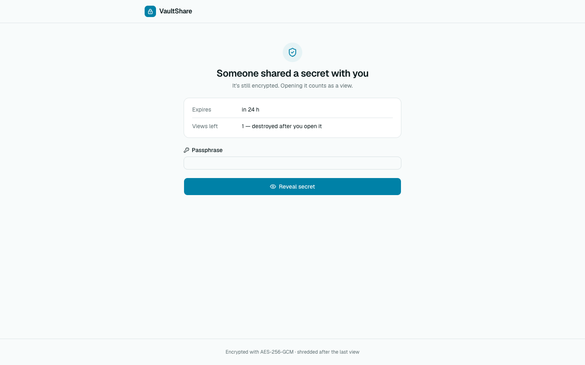
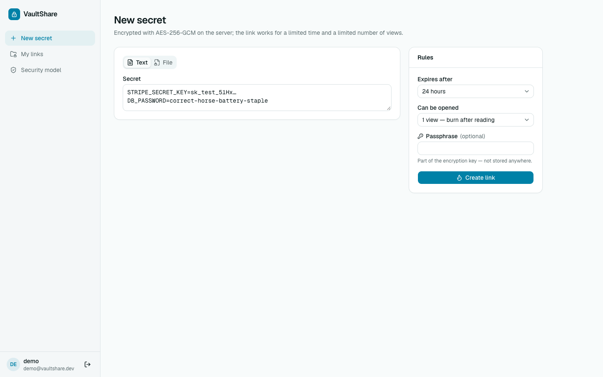
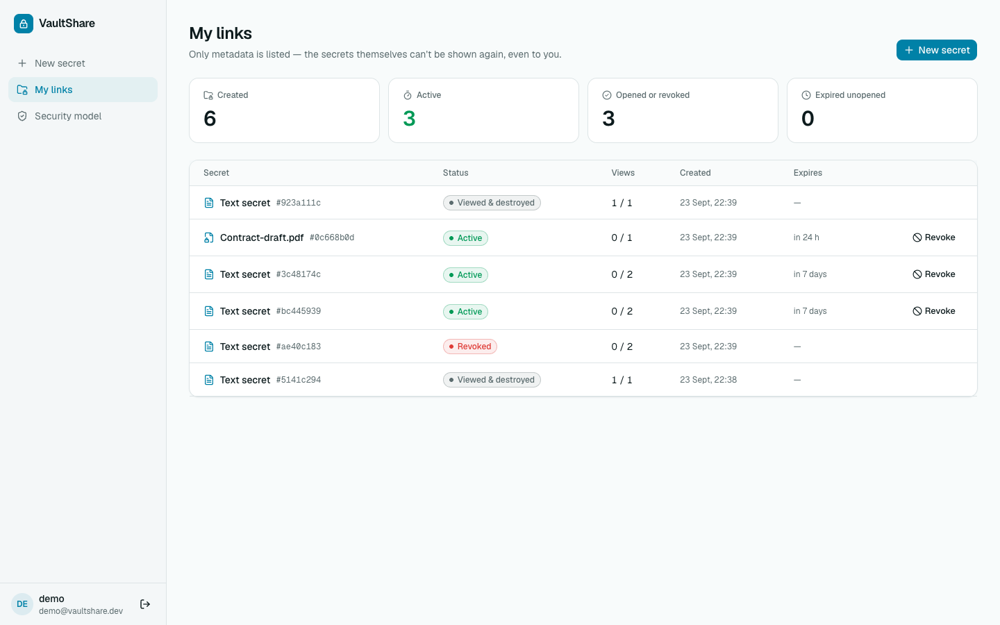
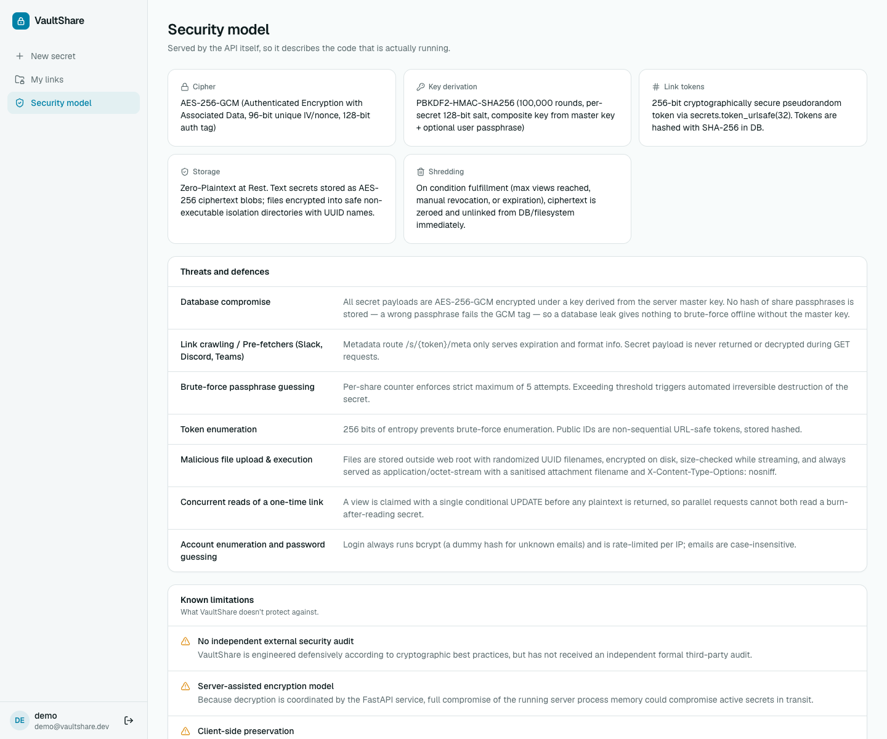
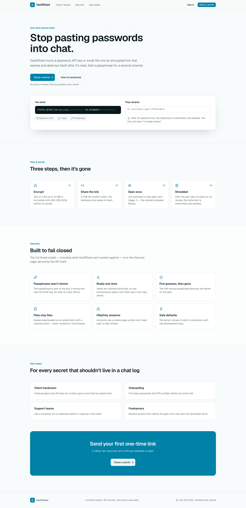
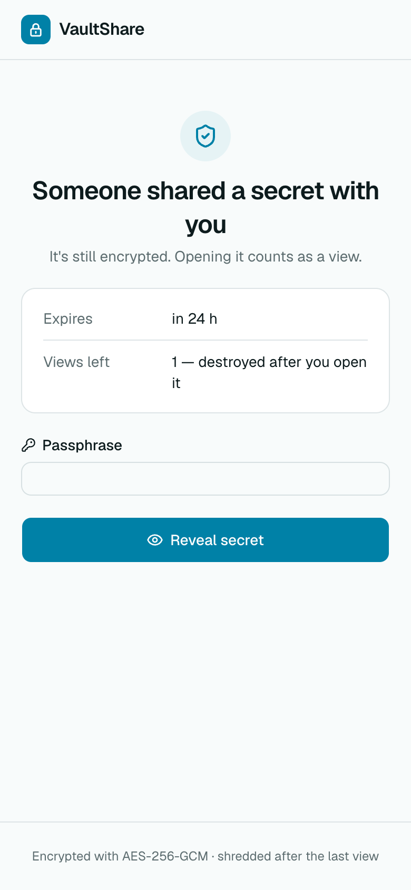
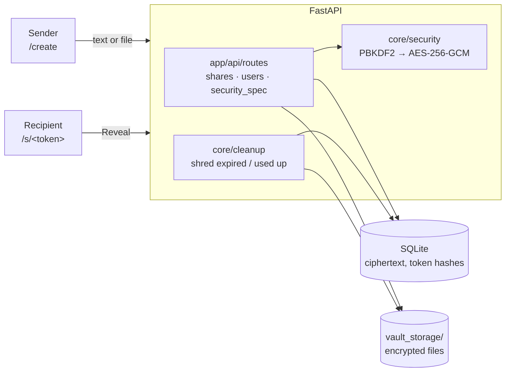
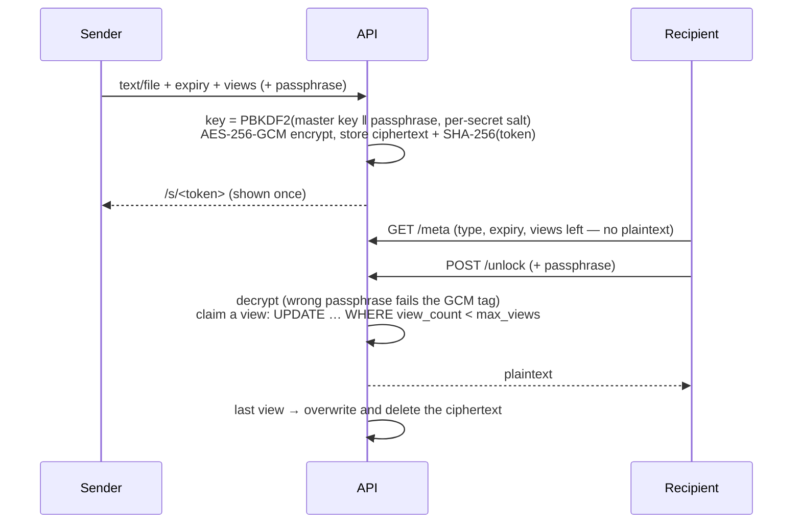

# VaultShare

**Stop pasting passwords into chat.** VaultShare turns a password, API key or small file
into an encrypted link that expires and destroys itself after it's read. A passphrase
can be added and sent over a second channel. Recipients see nothing until they press
**Reveal**, so chat-app link previews can't burn the secret.

It is a one-time secret sharer, not a password manager. Nothing stays readable, not even
for the sender.

> Portfolio project. The demo account and its links are created by the seed script.



| New secret | My links |
| --- | --- |
|  |  |
| **Security model (served by the API)** | **Landing page** |
|  |  |

<p align="center"></p>

## Contents

- [Features](#features)
- [Architecture](#architecture)
- [Secret lifecycle](#secret-lifecycle)
- [Security](#security)
- [API overview](#api-overview)
- [Getting started](#getting-started)
- [Demo walkthrough](#demo-walkthrough)
- [Testing](#testing)
- [Environment variables](#environment-variables)
- [Known limitations](#known-limitations)

## Features

- **Text or files** up to 10 MB, encrypted with AES-256-GCM before they're stored.
- **Expiry:** 10 minutes, 1 hour, 24 hours or 7 days.
- **View limit:** 1 (burn after reading), 2 or 5.
- **Optional passphrase:** it becomes part of the encryption key and is never stored.
  The fifth wrong guess destroys the secret.
- **Recipient page** at `/s/<token>`: it shows only the type, expiry and views left
  until **Reveal** or **Download** is pressed.
- **My links** (optional account): status, views and expiry for every link you created,
  and **Revoke** to destroy one immediately.
- **Security model page:** served by the API itself, so it always describes the running
  code, including what VaultShare can't protect against.

## Architecture



```
backend/app
├── api/routes/     shares, users (register/login/logout/me), security_spec
├── api/deps.py     current user from the HttpOnly cookie or a Bearer token
├── core/           config (production guard), security (crypto), auth (bcrypt, JWT, rate limit), cleanup
├── models/         user, share (share, access log)
├── schemas/        request/response models
├── db/             base, async session
└── seed.py         demo account: python -m app.seed [--reset]
frontend/src
├── app/            landing, s/[token], login, register, (app)/create, (app)/dashboard, (app)/security
└── components/     kit/ (shared house style), session provider, auth form
```

## Secret lifecycle



## Security

| Threat | Defence |
| --- | --- |
| Database leak | Only ciphertext and token hashes are stored. No passphrase hash exists: a wrong passphrase fails the AES-GCM tag, so a stolen database has nothing to brute-force without the master key. |
| Two people opening a one-time link at once | A view is claimed with one conditional `UPDATE … WHERE view_count < max_views` before any plaintext is returned. Covered by a concurrency test. |
| Passphrase guessing | Five attempts per secret. The fifth wrong guess destroys it immediately. |
| Link previews and crawlers | `GET /meta` never decrypts. Plaintext needs an explicit `POST`. |
| Token guessing | 256-bit random tokens, stored as SHA-256 hashes. Another user's link looks "not found". |
| Malicious uploads | Size-checked while streaming. Always served as `application/octet-stream` with a sanitised, RFC 5987-encoded filename and `nosniff`. |
| Stolen sessions | The session is an HttpOnly, SameSite=Lax cookie. Page scripts can't read it. |
| Account enumeration and guessing | Login always runs bcrypt (a dummy hash for unknown emails), is rate-limited per IP, and treats emails case-insensitively. |
| Misconfiguration | With `ENV=production` the API refuses to start using the development master key or JWT secret. Empty keys are always refused. |
| Leftovers on disk | Every destroy path overwrites the encrypted file with zeroes before deleting it. |

## API overview

Interactive docs are at `http://localhost:8000/docs`. All paths start with `/api/v1`.

| Method | Path | |
| --- | --- | --- |
| POST | `/shares/text` | Create a text secret |
| POST | `/shares/file` | Create a file secret (multipart) |
| GET | `/shares/{token}/meta` | Type, expiry, views left (no plaintext) |
| POST | `/shares/{token}/unlock` | Reveal a text secret (+ passphrase) |
| POST | `/shares/{token}/download` | Download a file secret (+ passphrase) |
| DELETE | `/shares/{token}` | Revoke by token (owner only) |
| GET | `/shares/mine/all`, `/shares/mine/stats` | Your links and totals (metadata only) |
| DELETE | `/shares/mine/{id}` | Revoke from the dashboard (owner only) |
| POST | `/auth/register`, `/auth/login`, `/auth/logout` | Accounts (session cookie) |
| GET | `/auth/me` | Current user |
| GET | `/security/spec` | The security model shown in the app |

## Getting started

Requirements: Python 3.12+ and Node 20+.

```bash
make install        # backend venv + frontend deps
make seed           # demo account and links (resets the local database)
make api            # http://localhost:8000
make web            # http://localhost:3000
```

Without make:

```bash
cd backend && python3 -m venv .venv && .venv/bin/pip install -r requirements-dev.txt
cp ../.env.example ../.env
.venv/bin/python -m app.seed --reset
.venv/bin/uvicorn app.main:app --port 8000
cd ../frontend && npm install && npm run dev
```

Sign in as **demo@vaultshare.dev / VaultDemo-2026!** to see **My links**. Sharing works
without an account.

## Demo walkthrough

1. **New secret**: paste a password, pick *1 view*, add a passphrase, and **Create
   link**.
2. Open the link in a private window. It shows only the expiry and views left.
3. Enter a wrong passphrase: it's refused, with 4 attempts left. Enter the right one and
   the secret is revealed and destroyed.
4. Reload the link. It no longer works.
5. **My links** shows it as *Viewed & destroyed*. **Revoke** another link to destroy it
   early.

## Testing

```bash
make test           # 22 tests
```

The tests cover:
- encryption round trips and tamper resistance
- the text and file lifecycles and burn-after-reading
- the access log holding no secrets or IPs
- concurrent reveals
- no stored passphrase hash, and destruction on the fifth guess
- download headers and upload limits
- case-insensitive emails and the login rate limit
- the HttpOnly session cookie
- owner revocation
- the production and empty-key guards

CI runs the backend tests, then lints and builds the frontend
([.github/workflows/ci.yml](.github/workflows/ci.yml)).

## Environment variables

See [.env.example](.env.example).

| Variable | Default | |
| --- | --- | --- |
| `VAULT_MASTER_KEY` | development key | 32-byte URL-safe base64. **Required in production** |
| `JWT_SECRET` | development secret | Signs sessions. **Required in production** |
| `COOKIE_SECURE` | `false` | Set `true` behind HTTPS |
| `ACCESS_TOKEN_EXPIRE_MINUTES` | `1440` | Session length |
| `STORAGE_DIR` | `./vault_storage` | Encrypted files |
| `MAX_FILE_SIZE_BYTES` | `10485760` | Upload limit |
| `MAX_PASSWORD_ATTEMPTS` | `5` | Wrong passphrases before destruction |
| `CLEANUP_INTERVAL_SECONDS` | `300` | How often expired secrets are shredded |
| `DATABASE_URL` | `sqlite+aiosqlite:///./vaultshare.db` | Any async SQLAlchemy URL |

## Known limitations

- **Server-side encryption.** The server sees plaintext while encrypting and decrypting.
  A compromised running server can read secrets in transit; client-side encryption
  (with the key in the URL fragment) would remove that.
- Overwriting before deletion is best effort. On SSDs and copy-on-write filesystems the
  old blocks may survive until they're reused.
- Once revealed, VaultShare can't stop the recipient from copying the secret.
- The login rate limiter is in-process. Behind several workers, use a shared store.
- There has been no independent security audit.

## License

MIT © Moeijiro
